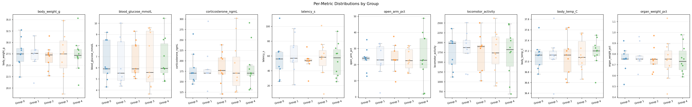
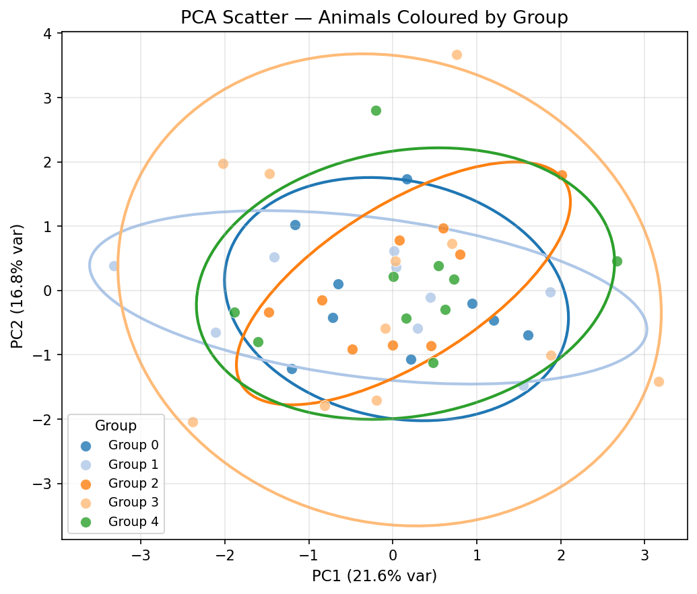
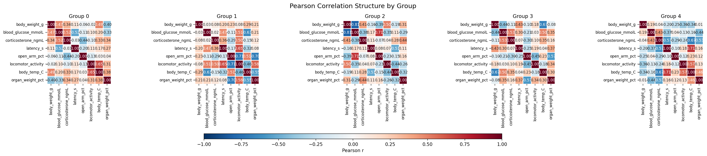
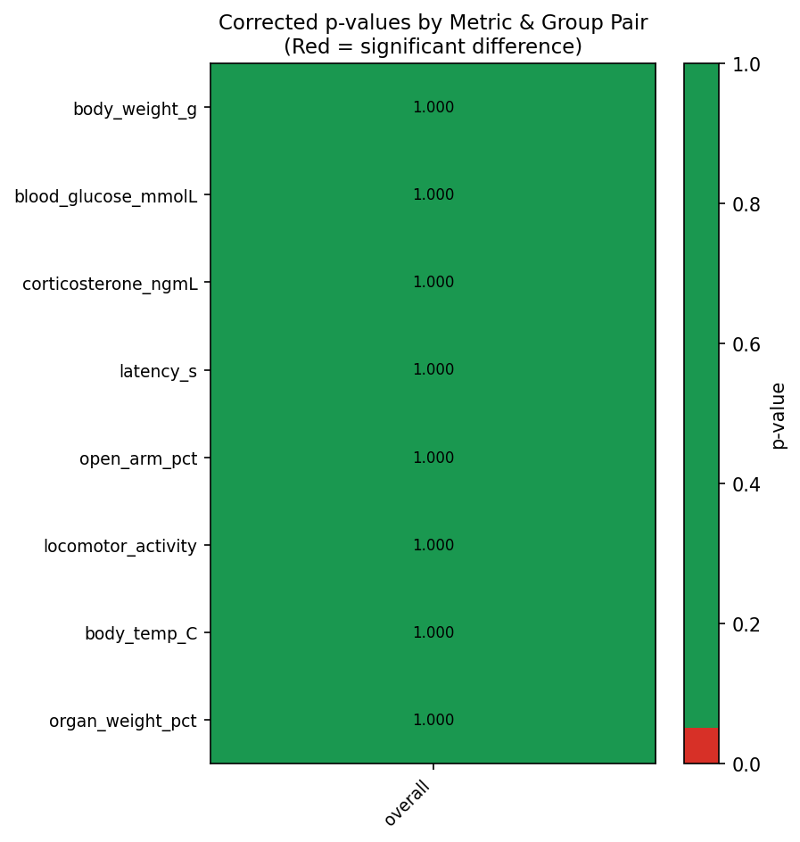

# Balanced Study — Preclinical Group Balancing Toolkit


A Python desktop application for assigning laboratory animals to experimental groups in a statistically balanced way. Load your baseline measurements, choose an algorithm, and get groups where no metric differs significantly between them — with full statistical validation and publication-ready figures.

---

## Installation

See **[INSTALL.md](INSTALL.md)** for full setup instructions (Python ≥ 3.10 required).

Quick start with pip:
```bash
git clone https://github.com/<your-username>/balanced_study.git
cd balanced_study
python -m venv venv
venv\Scripts\activate        # Windows
# source venv/bin/activate   # Mac/Linux
pip install -r requirements.txt
```

Or with Conda:
```bash
conda env create -f environment.yml
conda activate balanced_study
```

---

## Screenshots

| Distributions | PCA Scatter |
|:---:|:---:|
|  |  |

| Correlation Structure | Statistical p-value Heatmap |
|:---:|:---:|
|  |  |

---

## What this tool does and why it matters

In preclinical research, animals are often assigned to treatment groups before an experiment begins. If those groups are unbalanced — for example, if one group happens to have heavier animals on average — any observed treatment effect might actually be caused by that pre-existing difference, not by the treatment itself.

This tool solves that problem by finding an assignment of animals to groups that minimises all measurable baseline differences simultaneously, and then formally verifies the result with the same statistical tests a journal reviewer would expect.

---

## 5-Minute Quickstart

```bash
# 1. Activate the virtual environment (after running the install steps above)
venv\Scripts\activate       # Windows
# source venv/bin/activate  # Mac/Linux

# 2. Launch the GUI
python src\gui.py

# 3. In the GUI:
#    Panel 1: Browse → select your CSV → Confirm
#    Panel 2: Set k=3 groups, Algorithm 3 (Hybrid), click Run
#    Panel 4: Review results, export group CSVs
```

### Your CSV format
```
animal_id, body_weight_g, blood_glucose, litter_number
1, 24.3, 7.1, 2
2, 22.8, 6.8, 1
...
```
- First column: animal identifier (any name containing "id", or the first non-numeric column)
- Remaining numeric columns: baseline metrics to balance on
- Missing values (NaN/blank) are handled automatically

---

## Algorithms Explained (Plain English)

### Algorithm 1 — Dynamic Allocation (Serpentine)
**Analogy: Dealing cards from a sorted deck**

Sort animals from "lowest overall baseline" to "highest", then deal them out in a snake pattern: group 0 gets the 1st animal, group 1 gets the 2nd, group 2 gets the 3rd, then *back* to group 2 for the 4th, group 1 for the 5th, etc.

**Result:** Each group gets animals from every part of the distribution.  
**Speed:** Nearly instant — great for a quick first look.  
**Limitation:** Doesn't account for correlations between metrics.

### Algorithm 2 — Evolutionary Algorithm
**Analogy: Survival of the fittest group assignments**

Start with 100 random assignments. Score each one. Keep the best ones, combine pairs to produce children, randomly swap a few animals, repeat 1000 times. Return the best assignment found.

**Result:** Thorough search; often finds excellent solutions.  
**Speed:** Slower (seconds to minutes depending on n).  
**Limitation:** Stochastic — results vary between runs unless you fix the random seed.

### Algorithm 3 — Stratified Clustering Hybrid ✓ (Recommended)
**Analogy: Sorting litter-mates across cages, then fine-tuning**

1. **Decorrelate** the metrics using PCA (think: collapse "weight" and "glucose" into a single "metabolic profile" axis)
2. **Cluster** animals in this new space so similar animals are in the same cluster
3. **Distribute** each cluster's animals evenly across all groups (like splitting a litter across cages)
4. **Fine-tune** by randomly swapping pairs of animals whenever it improves the score

**Result:** Best balance on correlated metrics; robust across dataset types.  
**Speed:** Fast-to-moderate.  
**When to use:** Default choice for most preclinical studies.

---

## Statistical Tests Explained

| Test | What it checks | Plain English |
|------|---------------|---------------|
| Shapiro-Wilk | Is each group's data normally distributed? | Do the values form a bell curve? |
| One-way ANOVA | Do group *means* differ? (normal data) | Is one group's average higher? |
| Kruskal-Wallis | Do group *medians* differ? (non-normal) | Non-parametric version of ANOVA |
| Tukey HSD | Which pairs of groups differ? | Post-ANOVA pairwise comparison |
| Dunn's test | Which pairs of groups differ? | Post-KW pairwise comparison |
| MANOVA | Do groups differ in their joint profile? | Multivariate: all metrics at once |
| Permutation test | Same as MANOVA but for small n | Shuffle-based null distribution |
| Bonferroni correction | Controls false positives across m metrics | Multiplies p-values by number of tests |

**Interpretation:** For a well-balanced assignment, ALL p-values (after Bonferroni) should be > 0.05 — meaning "we cannot detect any significant difference between groups."

---

## GUI Panels

### Panel 1 — Input
Load your CSV, preview the data, override column detection, choose missing-data strategy.  
*(See [docs/gui_walkthrough.md](docs/gui_walkthrough.md) for screenshots)*

### Panel 2 — Configuration
Set k (number of groups), group names, algorithm, hyperparameters, and importance weights.  
The **Advanced Weights** panel lets you tell the algorithm which metrics matter most.

### Panel 3 — Run & Monitor
One-click run with live progress and a PASS/FAIL badge when done.  
Continuous Improvement mode reruns automatically until all tests pass.

### Panel 4 — Results
- **Groups Table**: each animal with its assigned group
- **Distributions**: KDE plots to visually verify balance
- **Covariance**: correlation structure comparison across groups
- **PCA**: 2D scatter coloured by group (well-balanced = interleaved, not clustered)
- **Stats Report**: full numerical output ready to copy into a methods section
- **Export**: group CSVs + PDF report

---

## Weight Sliders — Practical Guidance

| Slider | What it controls | Set higher when... |
|--------|-----------------|-------------------|
| Alpha | Penalty on group mean differences | The primary endpoint depends on baseline means |
| Beta | Penalty on within-group spread | You want tight, homogeneous groups |
| Gamma | Penalty on covariance differences | Metrics are strongly correlated (e.g., weight & organ mass) |
| Per-metric | Individual metric importance | Some metrics are primary endpoints or known confounders |

**Example:** Body weight is a strong confounder for drug dosing by body weight → set body weight importance to 2.0 or 3.0.

---

## FAQ

**Q1: What file format does the tool accept?**
CSV files with animals as rows and metrics as columns. The first column should be an animal identifier. Numeric columns are auto-detected as metrics.

**Q2: How many animals do I need?**
Minimum ~6 total (2 per group for k=3). Statistical power is very low below n=30 total. For n < 12, many tests will pass by default due to low power — this is expected behaviour.

**Q3: What if some animals have missing measurements?**
Use the "Missing data handling" dropdown in Panel 1. Median imputation is recommended for small samples. KNN is best if missingness is patterned.

**Q4: My run got FAIL on one metric — what should I do?**
Increase that metric's importance slider (e.g., from 1.0 to 2.0) in Panel 2 → Advanced Weights, then rerun. Alternatively, enable Continuous Improvement mode.

**Q5: Should I run all three algorithms and pick the best?**
Yes — Algorithm 1 gives a fast baseline, Algorithm 3 is the default recommendation. If Algorithm 3 fails validation, try Algorithm 2 with more generations.

**Q6: Is this reproducible? Will I get the same groups if I rerun?**
Algorithm 1 is always deterministic. Algorithms 2 and 3 are seeded (seed=42 by default) — same seed always produces the same result. Continuous Improvement mode changes the seed each iteration.

**Q7: Can I weight some animals more than others?**
Not currently. All animals are treated equally. If some animals are more important (e.g., more expensive to produce), consider running with k+1 groups and designating one as "reserve."

**Q8: How do I cite this tool in my manuscript?**
> Animals were assigned to experimental groups using the balanced_study software (v1.0.0) with the Stratified Clustering Hybrid algorithm. Statistical validity was confirmed by one-way ANOVA/Kruskal-Wallis per metric (Shapiro-Wilk selection) with Bonferroni correction and multivariate MANOVA. All corrected p-values exceeded 0.05.

---

## Citation-Ready Methods Paragraph

> Baseline metrics were collected prior to randomisation and submitted to the balanced_study software (v1.0.0). Animals were assigned to k groups using the Stratified Clustering Hybrid algorithm: baseline metrics were z-scored, Principal Component Analysis was applied for dimensionality reduction, k-means++ clustering stratified animals in principal component space, and simulated annealing (initial temperature T₀=10.0, cooling rate c=0.995) minimised the composite objective function F = α·D_between + β·V_within + γ·M_mahal (α=β=1.0, γ=0.5), where D_between is the weighted variance of group means, V_within is the weighted mean within-group variance, and M_mahal is the mean pairwise Mahalanobis distance between group centroids. Statistical equivalence of the final assignment was verified by one-way ANOVA (normally distributed data, per Shapiro-Wilk) or Kruskal-Wallis test (non-normal data) for each metric separately, with Bonferroni correction for multiple comparisons, and by MANOVA (Wilks' lambda) across all metrics simultaneously. The null hypothesis of group equivalence was not rejected for any metric or for the multivariate test (all corrected p > 0.05).

---

## Project Structure

```
balanced_study/
├── src/                    ← Core Python modules
│   ├── data_loader.py      ← CSV ingestion and missing-data handling
│   ├── objective.py        ← Objective function (scoring)
│   ├── algorithms.py       ← Three balancing algorithms
│   ├── stats_validator.py  ← Statistical validation engine
│   ├── visualizer.py       ← Figure generation (matplotlib + plotly)
│   └── gui.py              ← PyQt6 desktop application
├── benchmark/              ← Benchmark scripts and results
├── synthetic/              ← 9 synthetic test datasets + manifest
├── tests/                  ← pytest unit tests
├── docs/                   ← Detailed documentation
├── example.csv             ← Example dataset (30 animals, 4 metrics)
├── generate_synthetic.py   ← Script to regenerate the synthetic variants
├── environment.yml         ← Conda environment definition
├── requirements.txt        ← pip dependency list
├── ASSUMPTIONS.md          ← All design assumptions logged
└── INSTALL.md              ← Step-by-step installation guide
```

---

## License

MIT License — see [LICENSE](LICENSE) for details.

This software is provided for research use. It does not constitute medical or regulatory advice.
